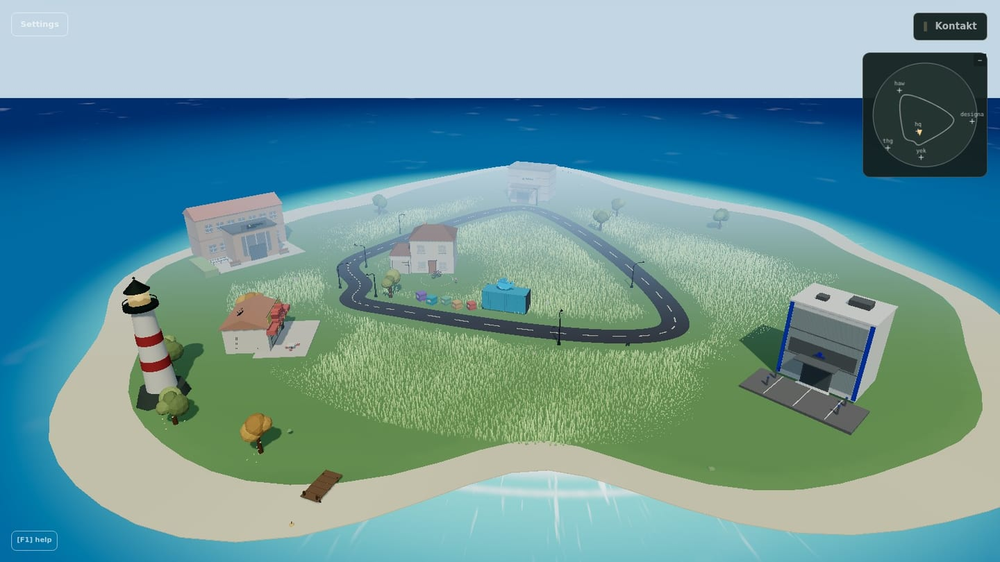
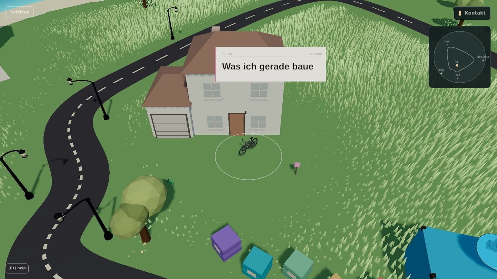
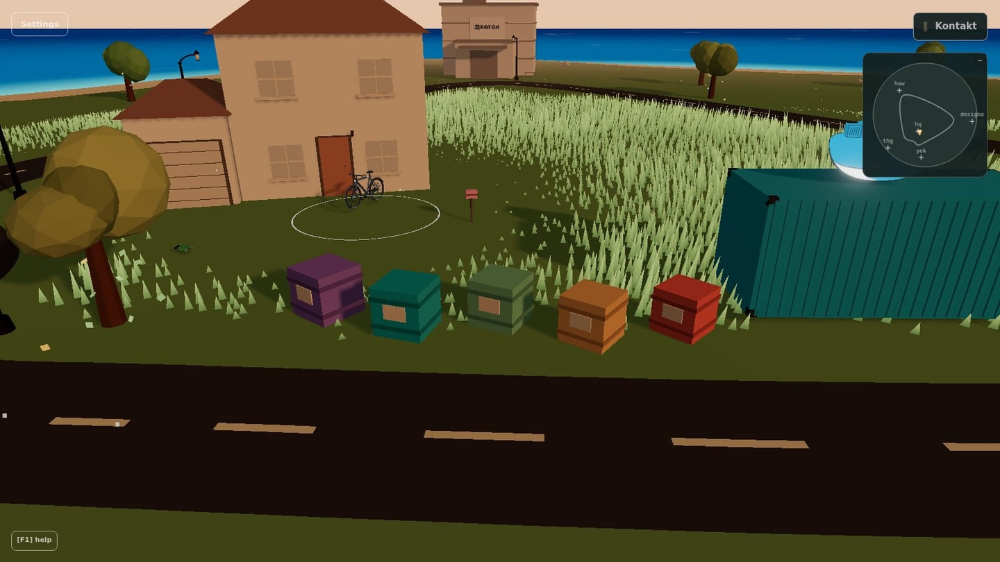
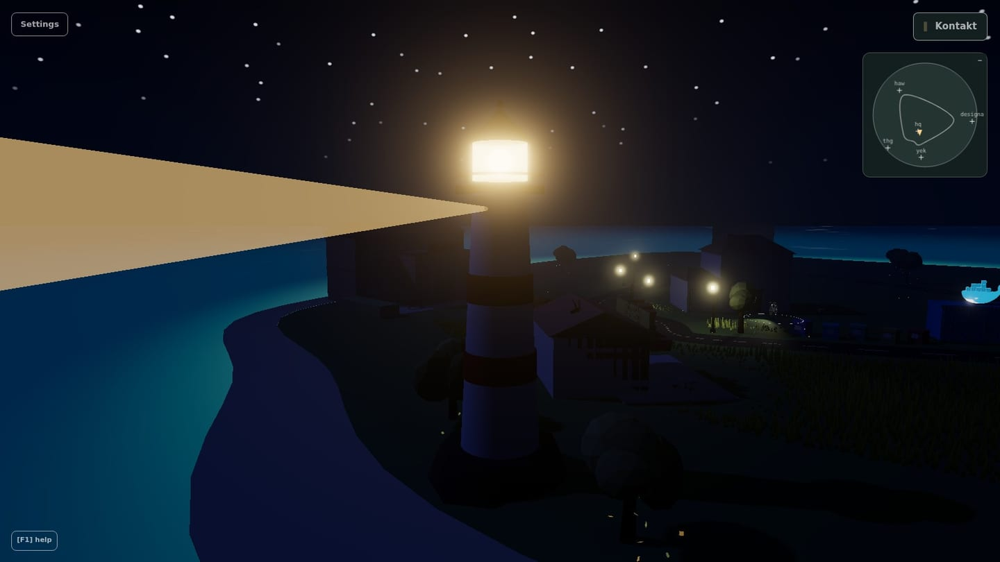
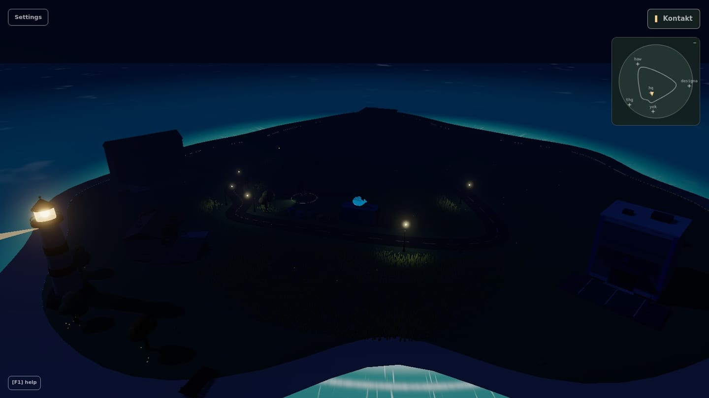
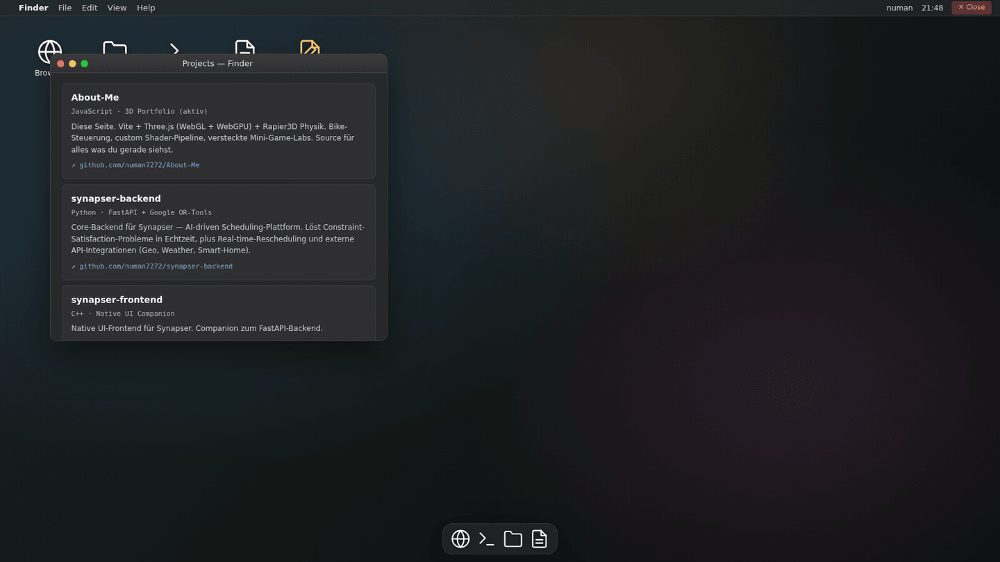
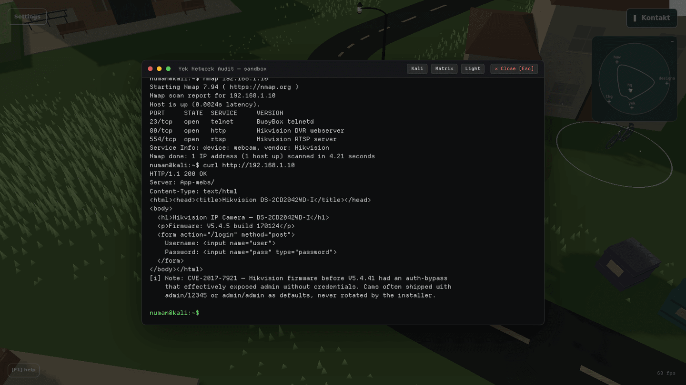

# About-Me · v2

> An interactive 3D portfolio. Drive a bike around a small island, visit stations that map to my education and work, browse my projects in a little harbor, and find a few hidden labs along the way.
>
> Built by **Numan Yesil**, Wirtschaftsinformatik @ HAW Kiel.

[](https://threejs.org)
[](https://vitejs.dev)
[](https://rapier.rs)
[](https://www.w3.org/TR/webgpu/)
[](LICENSE)

**Live:** [numan-yesil.com](https://numan-yesil.com)

<p align="center">
  
  <br>
  <sub>The whole island — five career stations, the project harbor, and a lighthouse on a headland the code finds itself.</sub>
</p>

---

## What this is

A from-scratch rewrite of my old Next.js portfolio on a modern, framework-light stack. Same idea (you drive a bike, visit stations, learn about me), but every layer is rebuilt by someone who wanted tight control over the render loop, the physics tick, and the shader pipeline instead of fighting framework abstractions.

Two ways in:

- **If you're hiring:** hit the **▶ Tour** button at the top. It walks you through the career stations in a few minutes. The contact panel (top-right) also links my **résumé**.
- **If you're a developer:** the bike physics, the dual-shader pipeline (WebGL `ShaderMaterial` + WebGPU `NodeMaterial`/TSL), the boot reveal, and the in-world joystick are the interesting parts of the source.

---

## Tech stack

| Layer        | Choice                             | Why                                                                       |
| ------------ | ---------------------------------- | ------------------------------------------------------------------------- |
| Bundler      | **Vite 8**                         | HMR for shader edits matters more than I expected                         |
| Renderer     | **Three.js r184**                  | The post-`v0.170` API split + TSL was the right time to commit            |
| Physics      | **Rapier3D-compat 0.19**           | Capsule colliders, deterministic, WASM-loaded async, no native deps       |
| Shaders      | Custom **GLSL** + **TSL** (WebGPU) | Two pipelines: WebGL stays the safe default, WebGPU is the opt-in path     |
| UI shell     | **React 19**                       | Only the menu chrome (settings, drawer, contact). The canvas is not React |
| State        | Plain class singletons             | No Redux, no Context, no global store                                     |
| Build target | ES2022 modules                     | Modern browsers only; this is a portfolio, not enterprise software       |

The canvas, the game loop, the physics step, and every shader live in plain ES modules. React only renders the surrounding menu chrome; wrapping `<Canvas>` in react-three-fiber would have been a downgrade here.

---

## Highlights

- **Dual renderer.** WebGL by default; WebGPU is selectable in Settings. Every custom shader exists twice, as GLSL (`onBeforeCompile` injection) and as TSL `NodeMaterial`, and the world looks identical on both.
- **Boot reveal.** On load the world is clipped to a small circle around the spawn (a "storm"-style radial cut, à la a certain battle-royale), then expands over the whole island on the first click. Works under both renderers (fragment discard on WebGL, `opacityNode` + alpha-test on WebGPU).
- **Project harbor.** A pier by the water with one crate per flagship GitHub project. Click a crate to open an info card with the stack and a repo link.
- **Lighthouse.** Sits on a headland the code finds itself (terrain sampling). At night the lamp glows and a beam sweeps out over the water.
- **Day/night cycle**, procedural grass and ocean, wind-driven trees and falling leaves, street lamps that light up at dusk, and a gentle ambient soundscape.
- **Two control schemes:** keyboard/joystick, or tap-to-move (LoL-style), switchable on first launch and in Settings.

---

## Screenshots

<table>
  <tr>
    <td width="50%" valign="top">
      
      <br><sub><b>Follow-cam.</b> You spawn outside HQ and drive the bike between stations.</sub>
    </td>
    <td width="50%" valign="top">
      
      <br><sub><b>Project harbor.</b> One crate per flagship GitHub project — click for the stack and repo link.</sub>
    </td>
  </tr>
  <tr>
    <td width="50%" valign="top">
      
      <br><sub><b>Lighthouse.</b> At night the lamp glows and a beam sweeps out over the Baltic.</sub>
    </td>
    <td width="50%" valign="top">
      
      <br><sub><b>Day/night cycle.</b> Street lamps and the lighthouse beam take over after dusk.</sub>
    </td>
  </tr>
  <tr>
    <td width="50%" valign="top">
      
      <br><sub><b>NumanOS.</b> A fake macOS desktop inside the HQ building — and it hides a SQL-injection lab.</sub>
    </td>
    <td width="50%" valign="top">
      
      <br><sub><b>Hidden lab.</b> Audit a fictional Hikvision IP-cam: <code>nmap</code> → <code>curl</code> → <code>telnet</code> (CVE-2017-7921).</sub>
    </td>
  </tr>
</table>

> All shots are from the running app (WebGL renderer). Live version: [numan-yesil.com](https://numan-yesil.com).

---

## Architecture

```
src/
├── Game.js                  # Singleton: owns scene, time, inputs, renderer, world, UI
├── core/
│   ├── Renderer.js          # WebGL + WebGPU swappable; bloom postprocess; device-loss recovery
│   ├── CameraRig.js         # Follow-cam + OrbitControls + cinematic fly-to
│   ├── Time.js              # delta (clamped), elapsed, tick events
│   ├── Inputs.js            # Keyboard + pointer + canvas events
│   ├── Physics.js           # Rapier world, async WASM init, fixed-timestep accumulator
│   ├── AudioManager.js      # Ambient loop + procedural seaside soundscape
│   └── Debug.js             # Tweakpane panels (opt-in via ?debug=1)
├── world/
│   ├── World.js             # Orchestrator: builds island, road, harbor, lighthouse, player…
│   ├── Island.js            # GLB loader, building/egg/landmark indexing, terrain sampling
│   ├── Player.js            # Bike rigidbody + visual + control logic
│   ├── BikeHeadlight.js     # Spotlight that follows the bike
│   ├── Road.js              # Procedural curve through the stations
│   ├── Grass.js             # Instanced triangle-blade grass, GLSL + TSL, camera-follow tile
│   ├── Ocean.js             # Animated water with rolling surf at the shore
│   ├── SkyDome.js           # Gradient sky + sun disc + night stars (GLSL + TSL)
│   ├── Nature.js            # Procedural trees, falling leaves, pollen motes (InstancedMesh)
│   ├── Wind.js              # Global wind singleton feeding grass + trees
│   ├── Harbor.js            # Project harbor: clickable GitHub-project crates
│   ├── Lighthouse.js        # Headland lighthouse with night beam
│   ├── StreetLamps.js       # Light-pools along the road
│   ├── DayCycle.js          # Time-of-day → sun/ambient/sky/fog + nightFactor
│   ├── BootReveal.js        # Storm-clip boot screen (WebGL + WebGPU paths)
│   ├── ProximityTrigger.js  # Egg + building enter/exit
│   ├── EggClickHandler.js   # Raycast-clickable egg/crate meshes
│   ├── TapToMoveController.js
│   ├── ColliderDebug.js     # Collider wireframes (toggle: C)
│   └── spawn.js             # Shared spawn constant
├── ui/
│   ├── Ui.js                # UI orchestrator
│   ├── Hud.js, MiniMap.js, InfoCard.js, LoadingSplash.js, …
│   ├── TouchJoystick.js     # In-world 3D dot-trail joystick (mobile)
│   ├── ControlModePicker.js # Joystick vs tap-to-move
│   ├── contact/             # Contact panel (email, résumé link, LinkedIn, GitHub)
│   ├── walkthrough/         # Tour state machine + bottom drawer + 3D station labels
│   └── miniGames/           # Building apps + hidden labs (see below)
└── data/
    ├── content.js           # i18n strings + project-harbor copy (DE/EN)
    └── stations.js          # Station copy + tour order + camera setups

cv/        # Full résumé (with address/phone); NOT deployed, sent on application
public/    # Static assets + cv.html (public, redacted résumé)
```

### Game loop

Update order, applied in `World.update()` every frame:

```
DayCycle → Sky → Wind → Island → Road → StreetLamps → Grass → Nature
        → Harbor → Lighthouse → Ocean
        → Player (reads inputs, writes physics)
        → ProximityTrigger → StationLabels
```

`Physics.update()` steps the Rapier world on a **fixed 1/60 s timestep accumulator** (it accumulates real elapsed time and runs whole steps), so the bike moves at the same real-world speed regardless of framerate. `CameraRig.update()` runs separately in `Game.update()` after the world step.

### Bike controls

| Action       | Desktop               | Mobile                    |
| ------------ | --------------------- | ------------------------- |
| Forward      | `W` / `↑`             | Joystick up               |
| Backward     | `S` / `↓`             | Joystick down             |
| Steer        | `A` `D` / `←` `→`     | Joystick left/right       |
| Brake        | `Space`               | Pull the joystick back    |
| Headlight    | `F`                   | n/a                       |
| Camera reset | (button bottom-right) | (button bottom-right)     |

Or switch to **tap-to-move**: click/tap a spot and the bike drives there on its own. Movement uses lerp-based velocity (`lerpT = min(1, ACCEL · dt)`) so the bike eases into top speed instead of slingshotting at high framerates.

---

## Stations, harbor & hidden labs

**Career stations** (the ▶ Tour visits them in order): the family business (Yek), school (THG), university (HAW), the working-student job (Designa), and HQ. Each building is clickable and opens a themed in-world app:

| Building | App            | What it is                                                              |
| -------- | -------------- | ----------------------------------------------------------------------- |
| HQ       | **NumanOS**    | Fake macOS desktop (my dev setup). Hides a **SQL-injection lab**.       |
| Designa  | **DesignaOS**  | Windows-11-style desktop with a fake Jira clone ("TestLab Tracker").    |
| HAW      | **HAWMoodle**  | A Moodle-style LMS, rebuilt to look like the real thing.                |
| THG      | **THGQuiz**    | A short general-knowledge quiz styled like an exam paper.               |
| Yek      | **YekKasse**   | A fake point-of-sale system, deliberately utilitarian.                  |

**Project harbor**: crates by the water, one per flagship GitHub project (Synapser, CTP, funke, Somnoscope, AI Password Awareness). Click one for the description, stack, and repo link.

**Hidden labs**: two small offensive-security walkthroughs framed inside the story:

- **Router egg** → a sandboxed Kali-style terminal. Audit a fictional IP-cam: `nmap`, `curl` for the banner, `telnet` with default credentials (CVE-2017-7921 is the reference). The story is real: this was my first network audit, at my family's restaurant in 2022.
- **SQL-injection lab** (inside NumanOS) → a vulnerable login form with a live SQL-query preview. The classic `' OR 1=1 --` bypass, plus an optional `UNION SELECT` exfiltration level.

Both labs are **client-side sandboxes**: no real commands run, no real network traffic. They show I can reason through an attack path, not that I'm claiming wizardry.

---

## Run locally

```bash
git clone -b v2 https://github.com/numan7272/About-Me.git
cd About-Me
npm install
npm run dev          # → http://localhost:5173/
```

```bash
npm run build        # → dist/
npm run preview      # serve the built version
npm run lint         # eslint
```

The renderer (WebGL / WebGPU) is chosen in the in-app **Settings** panel and stored in `localStorage`; WebGL is the default.

### URL parameters

| Param      | Effect                                            |
| ---------- | ------------------------------------------------- |
| `?touch=1` | Force mobile-style controls + the in-world joystick |
| `?fps`     | Show an FPS counter                               |
| `?debug=1` | Open the Tweakpane debug panels                   |

In-world keys: `C` toggles collider wireframes; `T` / `N` / `M` / `B` control the day/night cycle (pause / night / day / resume auto).

---

## Performance notes

- WebGL: stable 100–120 FPS on mid-range laptops; WebGPU is comparable with shadows on.
- Mobile: tested on Android Chrome and iOS Safari; comfortable 55–60 FPS on devices from ~2022 on.
- Grass is one camera-following tile, culled per blade around buildings and the road.
- The bike uses a capsule collider instead of a cuboid, which fixed a long-standing "sticking on trimesh edges" bug.
- WebGPU device loss (e.g. iOS backgrounding the tab) is detected and recovered with a reload; a repeated loss falls back to WebGL.

---

## Credits

- **Three.js** team for r184: the WebGPU + TSL story finally feels production-shaped.
- **Rapier3D** team for `rapier3d-compat`: the WASM-compat fork makes async setup trivial.

---

## License

The **source code** is licensed under the [MIT License](LICENSE).

It does **not** cover the bundled 3D models, textures, or fonts. Some of those are third-party works under their own licenses (including a VanMoof bicycle model and several Sketchfab-derived props). If you reuse this code, bring your own assets.

---

## Contact

- Live demo: [numan-yesil.com](https://numan-yesil.com)
- Email: hi@numan-yesil.com
- GitHub: [@numan7272](https://github.com/numan7272)
- LinkedIn: [in/numan-yesil](https://www.linkedin.com/in/numan-yesil)
